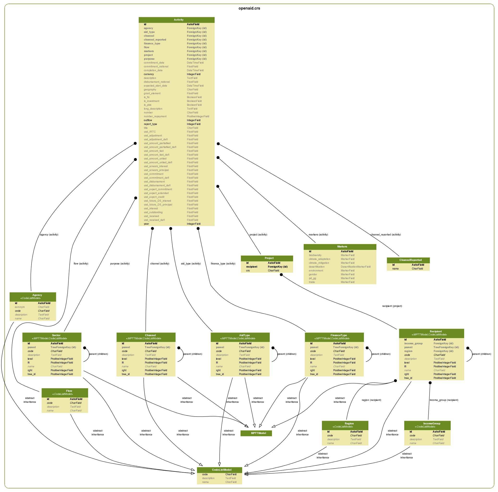

Analisi dei dati CRS
====================

I dati vengono prelevati da una schermata particolare del sito oecd (http://stats.oecd.org/ Creditor Reporting System)

    - Dati grezzi: `Raw data`_
    - Guida ai CRS: `CRS guide`_
    - Esempi di CRS: `CRS example`_
    - Data Structure Definition (DSD): `CRS dsd`_
    - Visione delle Code lists: `CRS codelist`_
    - Spiegazione delle Code lists: `CRS excel`_

I file sono 12 (1973-89, 1990-99, 2000-01, 2002-03, 2004-05, 2006, ... 2012)
sono formattati (male) in utf-16le (il cui bom è \\xff\\xfe).

Per parsare i csv ottenuti è necessaria una pulizia preventiva che rimuova il bom dalla seconda riga (errore comune quando si unisce l'header ai dati),
oltre che una conversione in utf-8.

Analisi delle colonne
---------------------

I dati dei CRS vengono esportati da un datawarehouse e presentano la tipica struttura a stella, cioè con un
modello centrale che rappresenta l'osservazione statistica, e dei modelli secondari rappresentanti code-list o parametri.
Ogni riga dei file .csv rappresenta un Report relativo ad un'Attività compiuta (identificata dal campo **initialreport**)

Informazioni sul progetto:

    1. Year
    2. donorcode
    3. donorname
    4. agencycode
    5. agencyname
    6. crsid
    7. projectnumber
    8. initialreport

Informazioni sul luogo dove incide:

    9. recipientcode
    10. recipientname
    11. regioncode
    12. regionname
    13. incomegroupcode
    14. incomegroupname

gli IncomeGroup e le Region categorizzano i Recipient.

Tipologia di aiuto:

    15. flowcode
    16. flowname
    17. bi_multi
    18. category [1]_
    19. finance_t
    20. aid_t

Quantificazione economica dell'aiuto:

    21. usd_commitment
    22. usd_disbursement

    23. usd_received
    24. usd_commitment_defl
    25. usd_disbursement_defl
    26. usd_received_defl
    27. usd_adjustment
    28. usd_adjustment_defl
    29. usd_amountuntied
    30. usd_amountpartialtied
    31. usd_amounttied
    32. usd_amountuntied_defl
    33. usd_amountpartialtied_defl
    34. usd_amounttied_defl
    35. usd_IRTC
    36. usd_expert_commitment
    37. usd_expert_extended
    38. usd_export_credit

Informazioni generali sulla spesa nazionale:

    39. currencycode
    40. commitment_national
    41. disbursement_national

Informazioni opzionali sul progetto:

    42. shortdescription
    43. projecttitle

Sector in cui incide il progetto e il suo Purpose (che rappresenta il terzo livello dei Sector):

    44. purposecode
    45. purposename
    46. sectorcode
    47. sectorname

Canale attraverso il quale vengono fatti gli aiuti:

    48. channelcode
    49. channelname

    50. channelreportedname

Versione testuale del luogo di interesse degli aiuti:

    51. geography

Date di inizio e fine:

    52. expectedstartdate
    53. completiondate

Descrizione lunga del progetto:

    54. longdescription

Marcatori che indicano l'interesse o meno relativo a settori specifici:

    55. gender
    56. environment
    57. trade
    58. pdgg
    59. FTC
    60. PBA
    61. investmentproject
    62. assocfinance
    63. biodiversity
    64. climateMitigation
    65. climateAdaptation
    66. desertification

Data di quando è stato fatto il report (o di quando sono stati dati i soldi?):

    67. commitmentdate

Altre informazioni sull'intervento economico:

    68. typerepayment [1]_
    69. numberrepayment [1]_
    70. interest1 [1]_
    71. interest2 [1]_
    72. repaydate1 [1]_
    73. repaydate2 [1]_
    74. grantelement
    75. usd_interest
    76. usd_outstanding
    77. usd_arrears_principal
    78. usd_arrears_interest
    79. usd_future_DS_principal
    80. usd_future_DS_interest

Esistono quattro categorie di parametri:

1. Informazioni generali sul progetto CRS
2. Informazioni specifiche sull'attività reportata relativa al progetto CRS
3. Code-lists del progetto CRS
    #. Recipient
    #. Agency
    #. Flow
    #. Channel
    #. Sector
    #. Purpose
    #. IncomeGroup
    #. Region
    #. AidType
    #. FinanceType
4. Marcatori del progetto CRS

Analizzando i dati sarà possibile valutare quali di questi campi appartengono alle categorie sopra citate.

Analisi dei dati
----------------

I dati contenuti nei .csv sono ripetuti molte volte come solitamente avviene nella conservazione delle attività dentro un datawarehouse.
Il numero totale di righe presenti è **2607209** dal 1973 (**1812418** dal 2004).
I progetti che riguardano l'Italia [2]_ sono in totale **54809** dal 1973, **32158** dal 2004 al 2012.

Gli attributi generali di un progetto CRS sono:

    - 2: donorcode
    - 3: donorname
    - 6: crsid
    - *... da aggiungere ...*

*NOTA: ci sono 18 righe dal 2004 che non hanno un crsid.*

Ogni record rappresentando un aggiornamento riguardo un CRS, ha un campo che ne identifica la tipologia
chiamato **initialreport** che può assumere i sguenti valori::

    0: Sconosciuto (18 righe)
    1: Report di nuova attività (15730 righe)
    2: Revisione
    3: Incremento/decremento del commitment o del disboursment (16404 righe)
    5: Dati provvisori
    8: Commitment = Disboursment (6 righe)

*NOTA: ci sono 18 righe dal 2004 che non una tipologia specificata (gli stessi che non hanno crsid).*

Le code-list sono popolate con i codici presenti in più fonti:

    Recipient, Region e IncomeGroup:
        sono codificati nel `CRS dsd`_ con il codice 'CL_CRS1_DAC_RECIPIENT' e listati nel `CRS excel`_ nella pagina *Recipient*
    Agency:
        `CRS excel`_ pagina *Agency*
    FinanceType:
        `CRS excel`_ pagina *Type of Finance*
    Channel:
        `CRS excel`_ pagina *Channels*
    Sector e Purpose:
        `CRS dsd`_ codice 'CL_CRS1_SECTOR'
    AidType:
        `CRS dsd`_ codice 'CL_CRS1_AIDTYPE'
    Flow:
        `CRS dsd`_ codice 'CL_CRS1_FLOW'

Il resto dei parametri sono relativi ad un singolo report di progetto.

Il file :download:`italy.csv.stats <_static/italy.csv.stats>` contiene un report dettagliato dei dati campo per campo, dei progetti promossi all'Italia [2]_.

*NOTA: 9 righe dei csv hanno un flowcode pari a 99, che non corrisponde a nessun codice. (vengon rimossi)

Schema dei Modelli
------------------

   I campi secondari che iniziano con **usd** sono stati rimossi per aumentare la leggibilità.

.. [1] Campo non utilizzato.
.. [2] L'Italia ha il Donor code pari a 6.

.. _Raw data: http://stats.oecd.org/DownloadFiles.aspx?HideTopMenu=yes&DatasetCode=crs1
.. _CRS guide: http://www.oecd.org/dac/stats/crsguide.htm
.. _CRS example: http://stats.oecd.org/Microdata/Microdata.aspx?DatasetCode=CRS1&RECIPIENT=10100&SECTOR=1000&FLOW=100&CHANNEL=100&AMOUNTTYPE=A&FLOWTYPE=115&AIDTYPE=100&DONOR=6&YEAR=2012&UsingMemberCodes=on&PAGE=2
.. _CRS dsd: http://stats.oecd.org/restsdmx/sdmx.ashx/GetDataStructure/CRS1/OECD
.. _CRS excel: http://www.oecd.org/dac/stats/documentupload/Codelist04042014.xls
.. _CRS codelist: http://www.oecd.org/dac/stats/dacandcrscodelists.htm